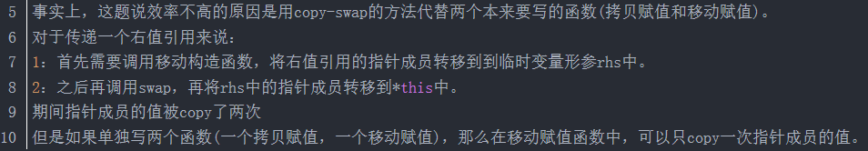

# Chapter 13. Copy Control

## Exercise 13.53

> Explain in detail what happens in the assignments of the `HasPtr` objects on page 541. In particular, describe step by step what happens to values of `hp`, `hp2`, and of the `rhs` parameter in the `HasPtr` assignment operator.

=======
